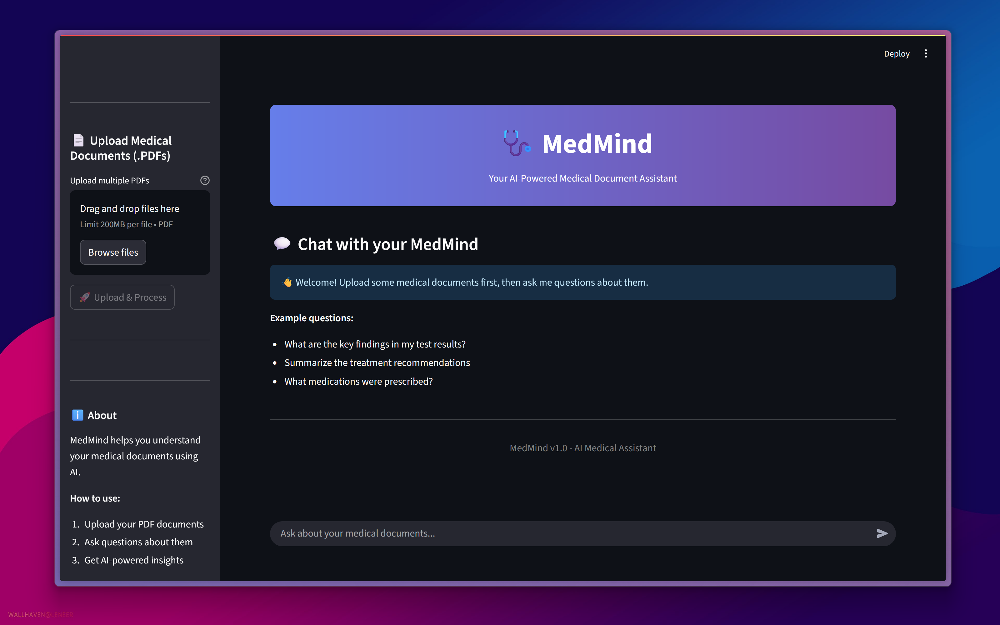
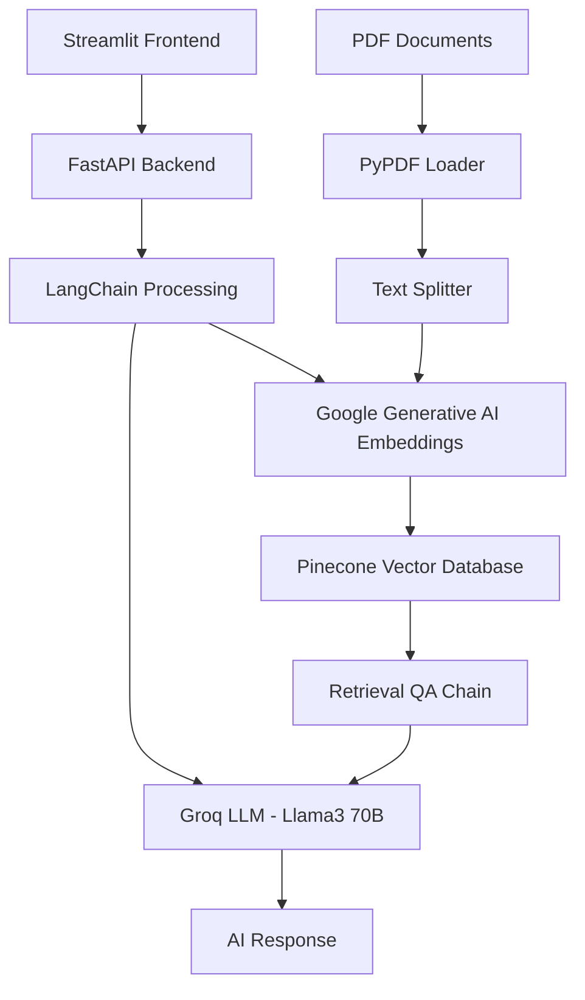

# 🩺 MedMind - AI-Powered Medical Document Assistant



[](https://python.org)
[](https://fastapi.tiangolo.com)
[](https://streamlit.io)
[](https://langchain.com)
[](LICENSE)

## 🎯 Overview

**MedMind** is an AI-powered medical document assistant designed specifically to help **medical students during their internship period**. The application bridges the gap between traditional paper-based patient medical histories and modern AI technology, enabling students to better understand diseases by comparing patient data with their study materials and medical literature.

### 🎓 Target Audience
- **Medical Students** in their internship/clinical rotation phase
- **Medical Residents** seeking quick reference and understanding
- **Healthcare Educators** looking for teaching aids

## ❗ Problem Statement

The medical history of patients is typically available only on paper, making it challenging to:
- **Compare patient data** with medical textbooks and literature
- **Quickly understand** complex medical conditions and terminology
- **Correlate symptoms** with potential diagnoses
- **Access relevant study material** in real-time during patient care

**MedMind solves this by:**
- Digitizing and analyzing medical documents using AI
- Providing instant, contextual answers about patient conditions
- Enabling comparison with medical knowledge bases
- Offering educational insights for better learning

## ✨ Features

### 🔧 Core Functionality
- **📄 Multi-PDF Upload**: Process multiple medical documents simultaneously
- **🤖 AI-Powered Q&A**: Ask natural language questions about uploaded documents
- **🔍 Intelligent Search**: Vector-based semantic search through document content
- **📚 Source Citation**: Provides references to specific document sections
- **💬 Interactive Chat**: Real-time conversation interface with medical documents
- **📥 Chat History Export**: Download conversation history for future reference

### 🎯 Medical-Specific Features
- **🩺 Medical Terminology Understanding**: Explains complex medical terms
- **📊 Test Result Analysis**: Helps interpret lab reports and diagnostic results
- **💊 Medication Information**: Provides insights on prescribed medications
- **🔬 Treatment Recommendations**: Summarizes treatment plans and procedures

### 🛡️ Safety & Privacy
- **🚫 No Medical Advice**: Clearly disclaims diagnostic capabilities
- **🔒 Local Processing**: Documents processed securely
- **⚠️ Educational Focus**: Designed for learning, not clinical decision-making

## 🏗️ Technical Architecture



### 🔄 Workflow
1. **Document Upload**: PDFs uploaded via Streamlit interface
2. **Text Extraction**: PyPDF extracts text content from documents
3. **Text Chunking**: Documents split into manageable chunks (500 chars, 100 overlap)
4. **Embedding Generation**: Google GenAI creates vector embeddings
5. **Vector Storage**: Embeddings stored in Pinecone database
6. **Query Processing**: User questions embedded and matched against vectors
7. **Context Retrieval**: Relevant document chunks retrieved
8. **AI Response**: Groq's Llama3-70B generates contextual answers

## 🛠️ Tech Stack

### **Frontend**
- **Streamlit** - Interactive web interface
- **Python Requests** - API communication

### **Backend**
- **FastAPI** - High-performance web framework
- **Uvicorn** - ASGI server
- **Python Multipart** - File upload handling

### **AI/ML Stack**
- **LangChain** - LLM application framework
- **LangChain Community** - Document loaders and utilities
- **Groq API** - Llama3-70B-8192 language model
- **Google Generative AI** - Text embeddings (embedding-001)
- **Pinecone** - Vector database for similarity search

### **Document Processing**
- **PyPDF** - PDF text extraction
- **RecursiveCharacterTextSplitter** - Intelligent text chunking

### **Infrastructure**
- **Pydantic** - Data validation
- **Python-dotenv** - Environment variable management
- **Loguru** - Advanced logging
- **TQDM** - Progress bars

## 🚀 Installation

### Prerequisites
- Python 3.13+
- Groq API Key
- Google AI API Key
- Pinecone API Key

### 1. Clone Repository
```bash
git clone https://github.com/aakifnehal/MedMind.git
cd MedMind
```

### 2. Set Up Backend
```bash
cd server
pip install -r requirements.txt
```

### 3. Set Up Frontend
```bash
cd ../client
pip install -r requirements.txt
```

### 4. Environment Configuration
Create `.env` file in the `server` directory:
```env
GROQ_API_KEY=your_groq_api_key_here
GOOGLE_API_KEY=your_google_ai_api_key_here
PINECONE_API_KEY=your_pinecone_api_key_here
PINECONE_INDEX_NAME=medmind-index
```

### 5. Start Backend Server
```bash
cd server
uvicorn main:app --reload --host 0.0.0.0 --port 8000
```

### 6. Start Frontend
```bash
cd client
streamlit run app.py
```

## 📖 Usage

### 1. **Upload Medical Documents**
- Navigate to the sidebar
- Upload one or multiple PDF documents
- Wait for processing completion

### 2. **Ask Questions**
- Type your question in the chat interface
- Example questions:
  - "What are the key findings in the lab results?"
  - "Explain the diagnosis mentioned in the report"
  - "What medications were prescribed and why?"
  - "Summarize the treatment recommendations"

### 3. **Review Responses**
- Get AI-powered answers with source citations
- View relevant document sections
- Download chat history for future reference

## 📡 API Documentation

### Upload Endpoint
```http
POST /upload_pdfs/
Content-Type: multipart/form-data

files: List[UploadFile]
```

### Query Endpoint
```http
POST /ask/
Content-Type: application/x-www-form-urlencoded

question: string
```

### Response Format
```json
{
  "response": "AI-generated answer",
  "sources": ["document1.pdf", "document2.pdf"]
}
```

## 📁 Project Structure

```
MedMind/
├── 📱 client/                    # Streamlit Frontend
│   ├── app.py                   # Main application
│   ├── config.py                # API configuration
│   ├── requirements.txt         # Frontend dependencies
│   ├── 🧩 components/
│   │   ├── chatUI.py           # Chat interface
│   │   ├── upload.py           # File upload component
│   │   └── history_download.py # Chat history export
│   └── 🔧 utils/
│       └── api.py              # API client functions
├── 🖥️ server/                   # FastAPI Backend
│   ├── main.py                 # FastAPI application
│   ├── logger.py               # Logging configuration
│   ├── requirements.txt        # Backend dependencies
│   ├── 🛠️ modules/
│   │   ├── llm.py             # LLM chain configuration
│   │   ├── load_vectorstore.py # Vector database operations
│   │   ├── query_handler.py    # Query processing
│   │   └── pdf_handlers.py     # PDF processing utilities
│   ├── 🛣️ routes/
│   │   ├── upload_pdfs.py      # Upload endpoint
│   │   └── ask_question.py     # Query endpoint
│   ├── 🔧 middleware/
│   │   └── exception_handlers.py # Error handling
│   └── 📁 uploaded_docs/       # Document storage
├── 🖼️ public/
│   └── UI.png                  # Application banner
├── pyproject.toml              # Project configuration
└── README.md                   # This file
```

## 🔐 Environment Variables

| Variable | Description | Required |
|----------|-------------|----------|
| `GROQ_API_KEY` | Groq API key for Llama3 model | Yes |
| `GOOGLE_API_KEY` | Google AI API key for embeddings | Yes |
| `PINECONE_API_KEY` | Pinecone API key for vector database | Yes |
| `PINECONE_INDEX_NAME` | Pinecone index name (default: medmind-index) | Yes |

## ⚠️ Important Disclaimer

**MedMind is designed for educational purposes only and should not be used as a substitute for professional medical advice, diagnosis, or treatment.**

- 🚫 **Not for Clinical Decisions**: Do not use for making clinical decisions
- 👨‍⚕️ **Consult Professionals**: Always consult qualified healthcare professionals
- 📚 **Educational Tool**: Intended to supplement medical education, not replace it
- 🔍 **Verify Information**: Always verify AI responses with authoritative medical sources
- 📋 **No Liability**: Developers assume no liability for medical decisions based on this tool

## 🙏 Acknowledgments

- **LangChain** team for the excellent LLM framework
- **Groq** for providing fast LLM inference
- **Google AI** for embedding models
- **Pinecone** for vector database services
- **Streamlit** team for the intuitive frontend framework
- **Medical Education Community** for inspiration and feedback

## 📞 Support

For questions, issues, or contributions:
- 🐛 [Open an Issue](https://github.com/aakifnehal/MedMind/issues)
- 💬 [Discussions](https://github.com/aakifnehal/MedMind/discussions)

---

<div align="center">
  <strong>Built with ❤️ for Medical Education</strong><br>
  <em>Empowering the next generation of healthcare professionals</em>
</div>
